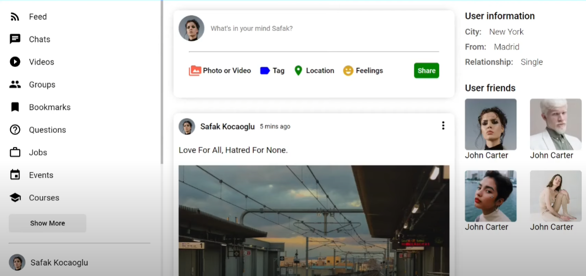

[WIP]
Social Media Web Application
============
   

A MERN stack social media REST API with logins, registery, and a number of CRUD operations (following users, friends list, liking/commenting and a homepage feed).  The api utilises Node.js routers and a MongoDB cloud instance.  The project was constructed largely with reference to https://github.com/safak

 

## Project Features
- [x] Creating Express App
- [x] Connecting MongoDB
- [x] Middlewares and First Request
- [x] Creating User Router
- [x] Creating User Model
- [x] Login and Register System
- [x] Node.js Express CRUD
- [ ] Follow and Unfollow User
- [x] Creating Post Model
- [x] Node.js MongoDB Post CRUD
- [ ] Like and Dislike Post
- [ ] Nested Asynchronous Fetch 

 

## Installation
Clone the repo, navigate to the project folder and create a `.env` containing `MONGO_URL = ` followed by your MongoDB connection code.  Runs the app in the development mode.  Open [http://localhost:3000](http://localhost:3000) to view it in the browser.

The page will reload if you make edits. You will also see any lint errors in the console.

 

## Requirements (Python)
- Npm
- MongoDB Cloud

 
 

    &nbsp;&nbsp;
    &nbsp;&nbsp;
    &nbsp;&nbsp;

